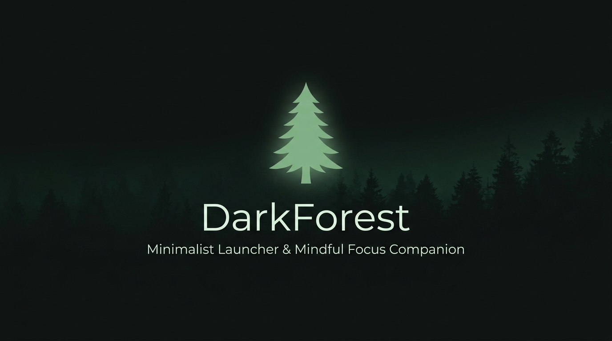
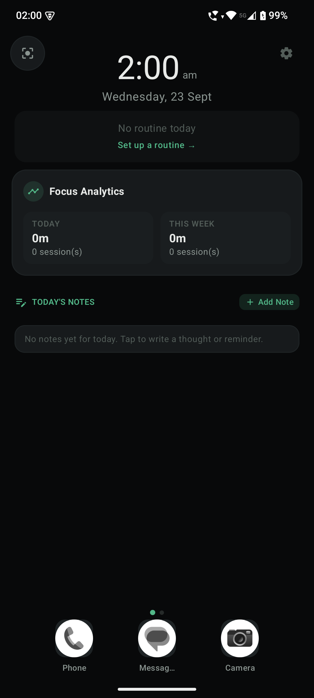
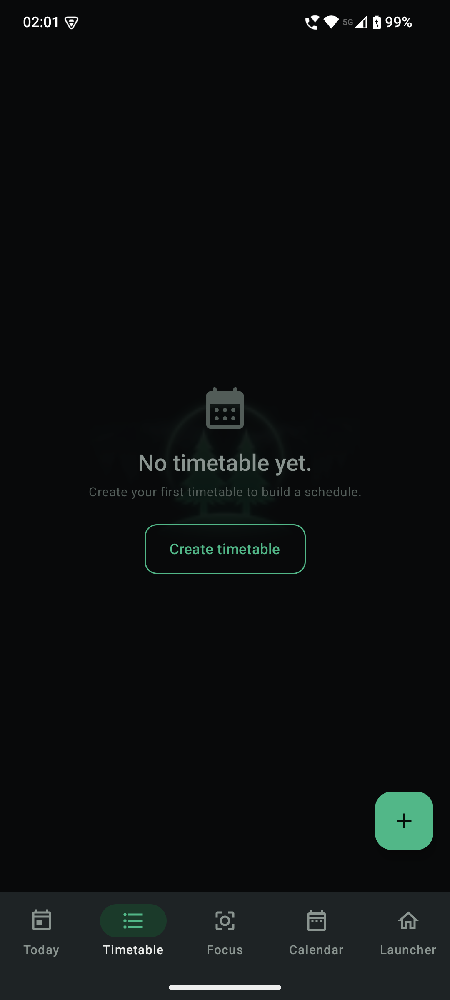
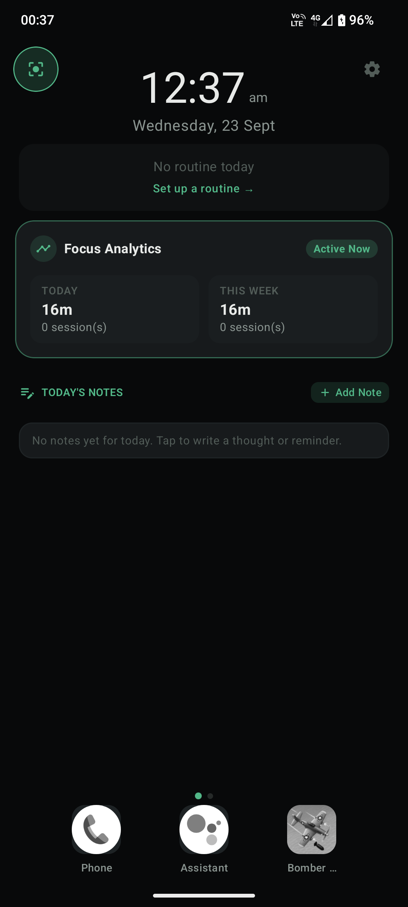
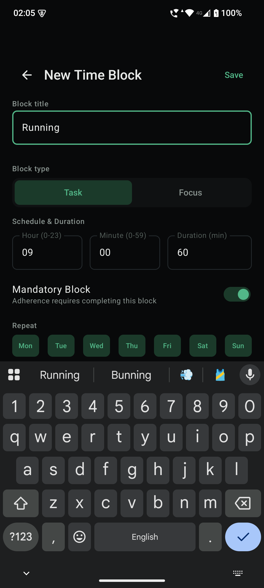
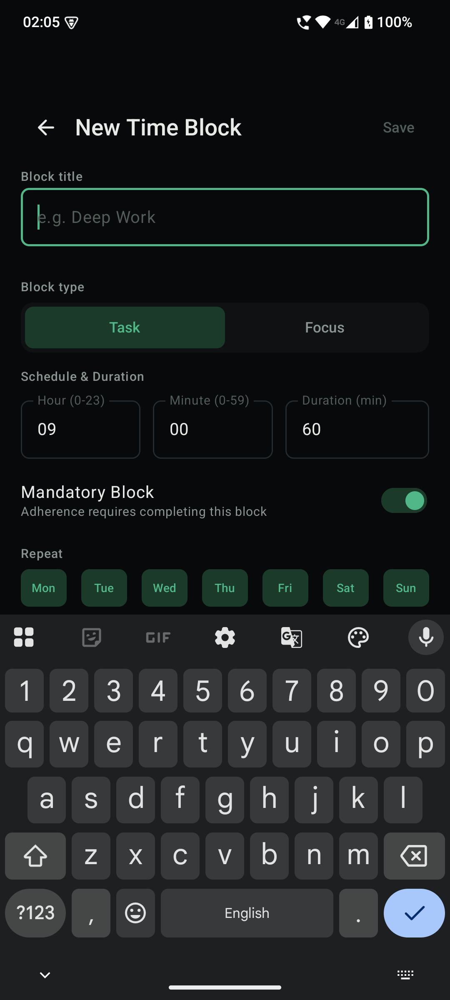
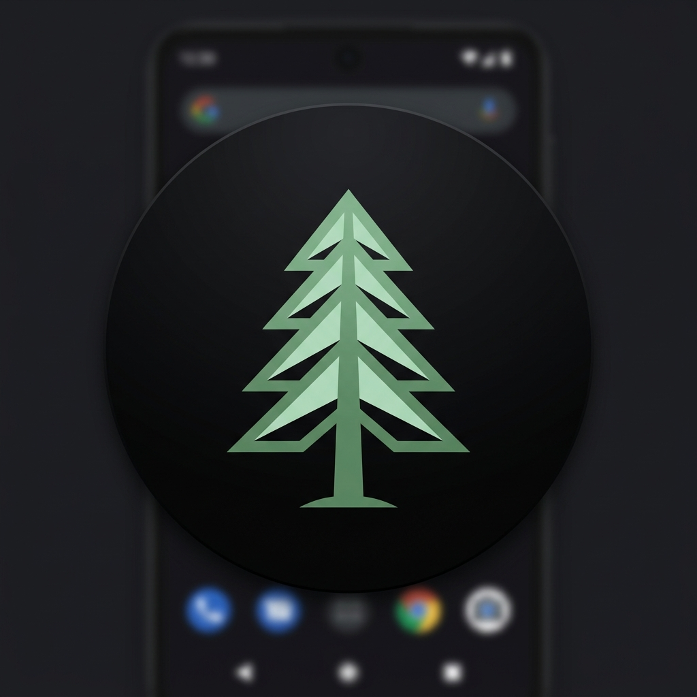

# 🌲 DarkForest

  

  <b>A Minimalist Obsidian Home Launcher & Timetable Focus Companion for Android</b> 
  <i>Cultivate mindful digital habits, eliminate algorithmic clutter, and reclaim your attention.</i>

  
  
  

---

## ⚡ Direct Download & Install

> 🚀 **[Click here to Download DarkForest v1.0.1 APK (Latest)](https://github.com/vinaykhosya/DarkForest/releases/latest/download/DarkForest-v1.0.1.apk)** *(Only 1.82 MB)*
>
> 📦 *Alternative direct mirror:* [DarkForest-release.apk](https://github.com/vinaykhosya/DarkForest/releases/download/v1.0.1/DarkForest-release.apk) | [View v1.0.1 Release Notes](https://github.com/vinaykhosya/DarkForest/releases/tag/v1.0.1)

1. Tap the download link above on your Android phone.
2. When prompted, tap **Install** (allow *"Install unknown apps"* if prompted in your browser).
3. Open **DarkForest** and set it as your default Home launcher!

---

## 📱 Visual Showcase

<table align="center">
  <tr>
    <td align="center"><b>Minimalist Home</b></td>
    <td align="center"><b>Timetable Planner</b></td>
    <td align="center"><b>Conscious Friction</b></td>
  </tr>
  <tr>
    <td></td>
    <td></td>
    <td></td>
  </tr>
  <tr>
    <td align="center"><b>Routine Editor</b></td>
    <td align="center"><b>Time-Block Config</b></td>
    <td align="center"><b>App Icon</b></td>
  </tr>
  <tr>
    <td></td>
    <td></td>
    <td></td>
  </tr>
</table>

---

## 🌟 Key Features

- **Minimalist Obsidian Home Screen:** Clean monochrome aesthetic that strips away loud badge icons, notification spam, and infinite doom-scroll traps.
- **Intentional App Dock:** Keep only your 3 essential apps in the bottom dock; search all other apps only when you genuinely intend to use them.
- **Routine & Timetable Blueprints:** Build daily routines with customized time-blocks for deep work, study, reading, and rest.
- **Conscious Friction Over Hard Locks:** Rather than frustrating rigid locks that make you uninstall the app, DarkForest presents mindful breathers and conscious pause prompts.
- **Zero-Network Architecture (100% Private):** DarkForest contains no `INTERNET` permissions. Your schedules, habits, and notes never leave your phone.

---

## 🔒 Privacy & Permissions

DarkForest is built with an absolute privacy-first philosophy:
- **No Internet Access:** Pure offline execution. No telemetry, no crash tracking servers, no external APIs.
- **Local Storage:** All timetable and session data is stored exclusively in on-device encrypted Room database.
- Read our full [Privacy Policy](PRIVACY_POLICY.md).

---

  Made with 🌲 for intentional living.

